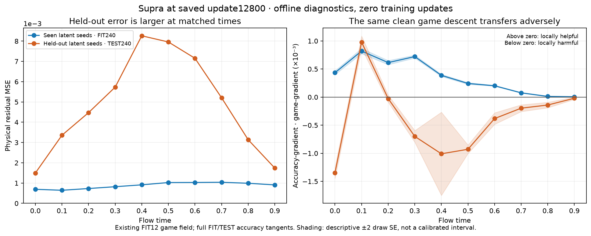

# Saved-point latent transfer: full FIT helps, held-out contexts harm

The new fixed12800 observation completed, and independent saved-array
verification qualified PASS with 213,147 checks. The observation retained the
earlier FIT12 clean/noisy game gradients and measured accuracy tangents on all
FIT240 and TEST240 records. It did not perform training or select a remedy.

| Panel | Physical MSE | Clean game projection | DV12 game projection |
|---|---:|---:|---:|
| Full FIT240 | 0.0008796561 | +0.0003521670 | +0.0002299186 |
| Full TEST240 | 0.0048525014 | -0.0003768681 | -0.0003758131 |
| Selected FIT12 cells | 0.0008988804 | +0.0009551136 | +0.0007074135 |
| Corresponding TEST12 cells | 0.0065646479 | -0.0011027654 | -0.0007935739 |

Positive projection means descending the measured game gradient locally helps
the specified panel's physical accuracy. Negative means locally worsening it.
Full FIT MSE is about 5.52 times lower than TEST MSE at this checkpoint.

The earlier twelve-query FIT panel did not invent the aggregate sign conflict:
its game directions also help the full training pool and each of its ten time
aggregates. Matched time/seed-index/path cells still conflict on held-out latents.
Both neutral and positive held-out trajectory aggregates are harmful. The first
held-out seed cohort is clearly harmful under the descriptive draw bands; the
second remains unresolved. These are fixed empirical cohorts, not independent
random-sample confidence claims.

The ordinary offline accuracy-direction control also conflicts:

| FIT accuracy direction versus full TEST accuracy direction | Cosine |
|---|---:|
| Full FIT240 | -0.1267604 |
| Original selected FIT12 | -0.0602042 |

Thus locally descending even full-training MSE would worsen held-out accuracy
at this point. No accuracy descent was actually applied. This supports a broader
latent-transfer/generalization question and does not isolate a game-specific
bug, a learned-noise cause, or a remedy. Original LoRA's training-fit score has
not been established by this measurement, so it does not compare the two
formulations' generalization gaps.

FIT and TEST share all six caption pairs, ten times, two trajectory paths and
CFG3. Their fixed latent seeds differ: FIT7063/7064 versus TEST39001/39002.
Actual training samples the complete FIT240 uniformly. Cached latent, time and
prompt correspondence was checked for all480 records; FIT seed/path labels are
explicit cache fields, while TEST labels additionally depend on authenticated
builder order. Both paths share each seed's initial latent at time zero; the
original empirical multiplicities are preserved.

The probe used 80 pool/time/seed/path cells, each covering six sources through
two B4 forwards with valid counts4 and2. Padding never contributed to MSE or
its tangent. All160 public forwards/VJPs completed, with zero native updates,
optimizer steps, critic forwards or new game/noise draws. Fresh owners used
public `initialize_` before optimizer/EMA construction and exact trained
restoration. Whole native/caller state, RNG, owners, frozen teacher and data
were checked before public rollback and restored exactly.

External GPU cost was **124.786395s /600s**, with all120 source/input pins
stable. Independent CPU verification cost was **36.500744s /300s**, with
all126 pins stable and no models/API/updates. Maximum regrouped TEST per-context
MSE discrepancy was1.862645149230957e-09. Aggregate TEST gradient norm differed
by0.3071% under regrouped B4 arithmetic, which is reported rather than treated
as byte parity. The selected-FIT MSE difference was2.168404344971009e-19.

Limits: these game gradients are from the prior FIT12 saved-D/completed-bandwidth
graph, not a new expectation over full-FIT native game updates. Tangents describe
one checkpoint and do not prove finite-step behavior or whole-run causality.
Draw standard errors are descriptive. Accuracy remains exclusively offline;
it supplies no loss, structural guard, candidate score, rate, selection or stop.

The next justified isolation should reproduce transfer between seen and unseen
latents while preserving full time support, then test an explicit remedy through
the ParticleGAN API with a numerical PASS/FAIL and an actual-training GIF.
No toy or training change is qualified by this readout.

- [Producer report](/ml2/hypergan/supra-final-precision-continuation/outputs/e22-supra-fit-test-stratified-tangents-v1/report.json).
- [Independent review](/ml2/hypergan/supra-final-precision-continuation/outputs/e22-supra-fit-test-stratified-tangents-v1/independent-review.json), SHA256 `023162c4dc72c00560cd1e719d3adbc4e72f422c17b627feb988e207404d3188`.
- [CPU completion](/ml2/hypergan/supra-final-precision-continuation/outputs/e22-supra-fit-test-stratified-tangents-v1-saved-review-v1/completion.json).
- [Prior game-pair interpretation](/ml2/hypergan/supra-final-precision-continuation/docs/e22_supra_fit_game_gradient_pair_readout_v1.md).
- [Long-run comparison](/ml2/hypergan/supra-final-precision-continuation/docs/e22_supra_final_precision_19200_readout_v1.md): the original remains ahead.
